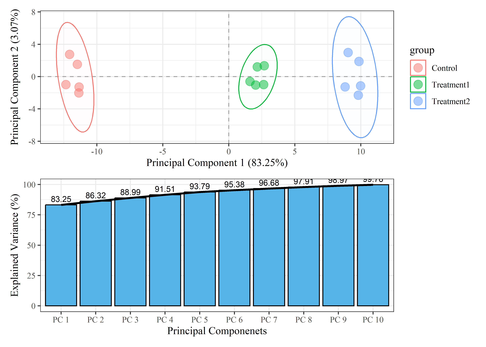
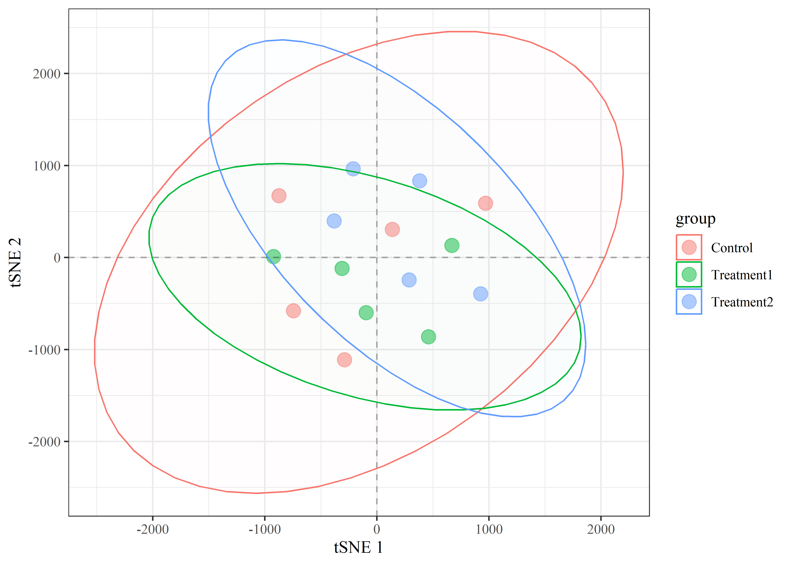
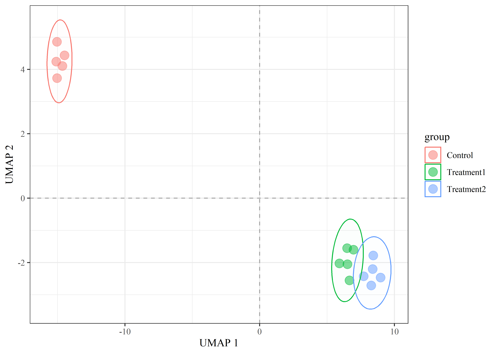

```         
proj = rprojroot::find_rstudio_root_file()
knitr:: opts_knit$set(root.dir = proj)

knitr::opts_chunk$set(
    fig.align = "center",
    message = FALSE,
    warning = FALSE,
    dpi = 600
)
```

# ***Dimensional Reduction Techniques for Proteomics & Chemometrics: PCA, t-SNE and UMAP***

*Sudipta Hazra*

*Abstract:*

This project is a part of **Food Proteomics Project**. It covers R code for different dimensional reduction techniques like,

1.  Principal Component Analysis (PCA)

2.  t-distributed Stochastic Neighbor Embedding (t-SNE)

3.  Uniform Manifold Approximation and Projection (UMAP)

## Introduction

### First time running the code,

The structure of the project folder is,

1.  Download the whole project folder,

2.  run a `renv::restore()`,

3.  The folder structure is as below,

```         
## .
## ├── data
## │   └── sample_data.csv
## ├── Dimensional Reduction.Rproj
## ├── LICENSE
## ├── plots
## │   ├── fig_pca_scorePlot_label.png
## │   ├── fig_tsne_Plot_label.png
## │   └── fig_umap_Plot_label.png
## ├── README.md
## ├── renv
## │   ├── activate.R
## │   ├── library
## │   │   └── windows
## │   ├── settings.json
## │   └── staging
## ├── renv.lock
## └── scripts
##     ├── 01_shiny_app_for_dimensional_reduction.R
##     ├── 02_Dimensional_Reduction.html
##     ├── 02_Dimensional_Reduction.md
##     ├── 02_Dimensional_Reduction.Rmd
##     ├── 02_Dimensional_Reduction_files
##     │   └── figure-markdown_strict
##     ├── 03_Dimensional_Reduction.R
##     └── README.md
```

4.  Keep the data at `data/sample_data.csv`, the data must contain `sample`, `label` columns along with the numeric variables. Below is an example,

| sample  | label  | Protein 1 | Protein 2 | …   | Protein 9 | Protein 10 |
|:--------|:-------|----------:|----------:|:----|----------:|-----------:|
| Sample1 | Label1 |        29 |        12 | …   |        19 |         10 |
| Sample2 | Label2 |        30 |        26 | …   |        21 |         29 |
| Sample3 | Label3 |        15 |        18 | …   |        16 |         27 |

5.  The codes are at `scripts/02_Dimensional_Reduction.Rmd`, run it,

6.  The plots will appear at `plots/`.

## Libraries

Libraries need to run the function are,

```         
# pacman is a wrapper function, it checkcs if a package is already installed then use library(), if doesn't exist then uses install.packages()
# install.packages("pacman")

# basic libraries
pacman::p_load(tidyverse, 
               ggplot2, 
               patchwork,
               plotly, # for interactive plotting
               glue,
               tsne, # for tsne
               umap, # for umap
               tidylog
               )

#for PCA
# basic stat package and ggplot is enough.
```

## Importing Data

```         
# importing data
sample_data  <- read.csv("data/sample_data.csv")

# separating numeric data
df <-  sample_data %>% 
  select(-"label")%>% 
  column_to_rownames("sample") 

# separating label (character/factor) data
labels <- sample_data %>% 
  select(c("sample", "label"))%>% 
  column_to_rownames("sample")
```

## General Functions

1.  General plot function to plot the PCA, t-SNE and UMAP result.

<!-- -->

```         
#general Dimension reduction Plot (for PCA, t-SNE, UMAP a general scatter plot function)

generate_dimension_reduction_plot <- function(model, x, y, model_output_data, label, labels, explained_variance = NULL) {
  
  # pca data and corresponding "sample" name
  model_output_data <- model_output_data  %>%
    rownames_to_column("sample")
  
  # group label and corresponding "sample" name
  # label <- "Feeding_Regime"
  group_names <- labels %>% 
    select(all_of(label))%>% 
    rownames_to_column("sample")
  
  colnames(group_names)[2] <- "group" 
  
  # joining pca data and group label by "sample"
  model_output_data <- model_output_data %>% 
    full_join(group_names, by = "sample") %>% 
    column_to_rownames("sample")
  
  
  print(model_output_data)
  
  p <-
    ggplot(model_output_data,
           aes(x = model_output_data[, x], y = model_output_data[, y], color = group)) +
    geom_point(size = 4, alpha = 5 / 10) +  # Marker size
    geom_hline(yintercept = 0, linetype="dashed", alpha = 3/10) +
    geom_vline(xintercept = 0, linetype="dashed", alpha = 3/10) +
    geom_polygon(stat = "ellipse",
                 aes(fill = group),
                 alpha = 0.01) +
    theme_bw(base_family = "serif")
  
  if (tolower(model) == "pca") {
    p <- p +
      labs(
        x = glue("Principal Component {x} ({explained_variance[x]}%)"),
        y = glue("Principal Component {y} ({explained_variance[y]}%)")
      )
    
  } else if (tolower(model) == "tsne"){
    p <- p  +
      labs(
        x = glue("tSNE {x}"),
        y = glue("tSNE {y}")
      )
  } else if (tolower(model) == "umap"){
    p <- p  +
      labs(
        x = glue("UMAP {x}"),
        y = glue("UMAP {y}")
      )
  } else{
    p <- p  +
      labs(
        x = glue("Component {x}"),
        y = glue("Component {y}")
      )
  }
  
  return(p)
}
```

1.  Function for plotting the PCA scree plot.

<!-- -->

```         
generate_pca_scree_plot <- function(scree_plot_data, n){
  scree_plot <- ggplot(scree_plot_data[1:n,], mapping = aes(x = reorder(PC_component, explained_variance), y = explained_variance)) +
    geom_bar(stat = "identity", fill="#56B4E9", colour="black") +
    geom_line(aes(x = 1:n, y = explained_variance), linewidth = 1) +
    geom_text(aes(label = round(explained_variance, 2)), vjust = -0.5, size = 3)+
    labs(x = "Principal Componenets",
         y = "Explained Variance (%)") +
    theme_bw(base_family = "serif")
  return(scree_plot)
}
```

## Dimensionaity Reduction

### Principal Component Analysis (PCA)

#### Defining the PCs to plot

```         
x = 1 # PC1
y = 2 # PC2
model = "pca"
```

#### Model building

```         
pca_model <- prcomp(df, scale. = TRUE)
```

#### Extracting the PCA results

```         
pca_data <- as.data.frame(pca_model$x)
```

#### Calculating explained variance

```         
explained_variance <- pca_model$sdev^2 / sum(pca_model$sdev^2)
explained_variance <- round(explained_variance * 100, 2)
```

#### Preparing Scree plot

```         
scree_plot_data <- data.frame(PC_component = paste0('PC ', 1: nrow(sample_data)), explained_variance = cumsum(explained_variance))
components_to_show = 10

scree_plot <- generate_pca_scree_plot(scree_plot_data, components_to_show)
```

#### Preparig Score plot

```         
for (label in colnames(labels)) {
  assign(paste0("fig_pca_scorePlot_", label), generate_dimension_reduction_plot("pca",x, y, pca_data, label, labels, explained_variance = explained_variance))
}

##                   PC1        PC2        PC3         PC4          PC5
## sample_ 1  -11.481077  1.5172966 -1.8636263 -2.42021654  0.142165496
## sample_ 2  -12.345718 -0.9830080 -1.2108219  1.30666720 -2.715981467
## sample_ 3  -11.365134 -2.0258271 -0.8951573  1.18827791  2.501091427
## sample_ 4  -12.069361  2.7434499  1.2891371  2.00811862  0.319543936
## sample_ 5  -11.344074 -1.2966892  3.1429656 -1.50761731 -0.197812439
## sample_ 6    2.029494 -1.0435272  0.4160259 -0.75052307 -0.497623099
## sample_ 7    1.603723 -0.6072384 -0.6323833 -0.06682436 -0.540959963
## sample_ 8    2.682233  1.3504277 -0.9189426 -0.48411338  0.127136684
## sample_ 9    2.640591 -0.9858646 -0.4954845 -1.33279126  0.478387926
## sample_ 10   2.155763  1.2006051  0.4381678  0.11473609  1.046288198
## sample_ 11   9.860839  1.8809545 -1.8326953 -2.25513566 -0.002541605
## sample_ 12   8.805914 -1.2717374 -1.1206906  1.77234483 -2.975011158
## sample_ 13   9.806726 -2.3060980 -0.9867621  1.51288973  2.628713344
## sample_ 14   9.033864  2.9759115  1.3941472  2.25789084  0.283060534
## sample_ 15   9.986217 -1.1486551  3.2761203 -1.34370364 -0.596457813
##                    PC6        PC7         PC8         PC9        PC10
## sample_ 1   0.80752663  0.5524524  0.73933278 -0.24083316  0.19993905
## sample_ 2  -0.26942007  0.2391701  0.52089531  0.25405290 -0.43004108
## sample_ 3   0.57769699  0.4120176  0.14201306 -0.02470875 -0.05661397
## sample_ 4  -0.29959022  0.1323328 -0.10260573 -0.69846212  0.45148736
## sample_ 5   0.57259449  0.2557083 -0.06672682 -0.10492155 -0.54118003
## sample_ 6  -0.95197208  0.9888296 -1.13989631  1.59669516  2.45480810
## sample_ 7   1.86526637 -3.1999609 -1.35412090 -0.71099910  0.70119018
## sample_ 8  -0.67509796  0.6638747 -3.04102051  0.56619280 -1.67422623
## sample_ 9  -3.55663088 -0.9135220  0.43742367 -1.77764021  0.02870734
## sample_ 10 -0.85038813 -1.8701048  1.46591971  2.63028179 -0.67617356
## sample_ 11  1.17401922  0.7556373  0.98353811 -0.26328282  0.16476797
## sample_ 12  0.06057480  0.4250113  0.65518786  0.04109257 -0.38599800
## sample_ 13  0.67722454  0.7711032  0.17778623 -0.16391255 -0.16251893
## sample_ 14  0.05768189  0.3730988  0.16998689 -0.77425717  0.49618758
## sample_ 15  0.81051442  0.4143517  0.41228666 -0.32929779 -0.57033576
##                    PC11         PC12          PC13         PC14          PC15
## sample_ 1   0.192464394  0.341387901  0.3325241928 -0.243521657 -6.106227e-16
## sample_ 2  -0.285372600 -0.212315041 -0.2617576148 -0.335890078  1.249001e-15
## sample_ 3  -0.076051987  0.370901263 -0.3521168705  0.257538540  1.200429e-15
## sample_ 4  -0.331309006 -0.182489029  0.3513927880  0.243006382 -1.249001e-15
## sample_ 5   0.498920887 -0.328391281 -0.0679798023  0.081551791  1.589007e-15
## sample_ 6  -0.020642663  0.006123531 -0.0024874200 -0.001167921  1.561251e-15
## sample_ 7  -0.009690017 -0.013139076 -0.0002178088 -0.018459395  1.543904e-15
## sample_ 8  -0.015102954  0.041714091 -0.0105985366  0.007300588  1.436351e-15
## sample_ 9   0.012961781 -0.003250562 -0.0271901257  0.011307375  6.661338e-16
## sample_ 10  0.016741282  0.004167468  0.0293694226  0.003718788  1.016548e-15
## sample_ 11 -0.157145180 -0.345434318 -0.2819960498  0.249494830  1.089406e-15
## sample_ 12  0.302098633  0.184027615  0.2370830913  0.319033082  1.922074e-15
## sample_ 13  0.025837602 -0.337723152  0.3095891694 -0.241710828  2.539635e-15
## sample_ 14  0.334023894  0.165663801 -0.3213854487 -0.246825473  3.136380e-15
## sample_ 15 -0.487734068  0.308756789  0.0657710131 -0.085376025  1.179612e-15
##                 group
## sample_ 1     Control
## sample_ 2     Control
## sample_ 3     Control
## sample_ 4     Control
## sample_ 5     Control
## sample_ 6  Treatment1
## sample_ 7  Treatment1
## sample_ 8  Treatment1
## sample_ 9  Treatment1
## sample_ 10 Treatment1
## sample_ 11 Treatment2
## sample_ 12 Treatment2
## sample_ 13 Treatment2
## sample_ 14 Treatment2
## sample_ 15 Treatment2
```

#### Plotting Score Plot and Scree Plot side by side

```         
fig_pca_scorePlot_label / scree_plot
```



### t-distributed Stochastic Neighbor Embedding (t-SNE)

#### Defining the parameters to plot

```         
x = 1
y = 2 
perplexity = 20
model = "tsne"
```

#### Model building

```         
set.seed(0)
tsne_model <- tsne(df, initial_dims = 2)
```

#### Extracting the t-SNE results

```         
tsne_data <- data.frame(tsne_model)
rownames(tsne_data) <- rownames(df)
```

#### Preparing t-SNE plots

```         
for (label in colnames(labels)) {
  assign(paste0("fig_tsne_Plot_", label), generate_dimension_reduction_plot(model, x, y, tsne_data, label, labels, explained_variance = NULL))
}

##                    X1          X2      group
## sample_ 1   137.80552   306.52022    Control
## sample_ 2   970.00462   589.54223    Control
## sample_ 3  -743.96363  -579.45344    Control
## sample_ 4  -873.97850   672.09052    Control
## sample_ 5  -289.55334 -1111.24598    Control
## sample_ 6  -922.11770    10.82222 Treatment1
## sample_ 7   669.06892   131.19936 Treatment1
## sample_ 8   459.86553  -860.71133 Treatment1
## sample_ 9  -311.33483  -118.59629 Treatment1
## sample_ 10  -95.40238  -599.17351 Treatment1
## sample_ 11  924.96556  -395.41001 Treatment2
## sample_ 12  381.35433   834.14713 Treatment2
## sample_ 13 -212.32166   964.31207 Treatment2
## sample_ 14 -380.97386   398.27128 Treatment2
## sample_ 15  286.58143  -242.31449 Treatment2
```

#### Plotting t-SNE plots

```         
fig_tsne_Plot_label
```



### Uniform Manifold Approximation and Projection (UMAP)

#### Defining parameters to plot

```         
x = 1
y = 2 
model = "umap"
```

#### Model building

```         
set.seed(0)
umap_model <- umap(df, n_components = 2, random_state = 15)
```

#### Extracting UMAP results

```         
umap_data <- data.frame(umap_model[["layout"]]) 
```

#### Preparing UMAP plots

```         
for (label in colnames(labels)) {
  assign(paste0("fig_umap_Plot_", label), generate_dimension_reduction_plot(model, x, y, umap_data, label, labels, explained_variance = NULL))
}

##                    X1        X2      group
## sample_ 1  -15.097286  4.241481    Control
## sample_ 2  -14.641664  4.104496    Control
## sample_ 3  -14.487303  4.433513    Control
## sample_ 4  -15.045793  4.857059    Control
## sample_ 5  -15.037231  3.727159    Control
## sample_ 6    6.963683 -1.599554 Treatment1
## sample_ 7    6.490202 -1.551804 Treatment1
## sample_ 8    5.915504 -2.024545 Treatment1
## sample_ 9    6.665017 -2.553795 Treatment1
## sample_ 10   6.510422 -2.052428 Treatment1
## sample_ 11   8.274942 -2.711330 Treatment2
## sample_ 12   8.424310 -1.779938 Treatment2
## sample_ 13   8.382863 -2.200341 Treatment2
## sample_ 14   7.712623 -2.425373 Treatment2
## sample_ 15   8.969712 -2.464601 Treatment2

fig_umap_Plot_label
```



### Save all the plots

```         
items <- ls()

for (item in items){
  # print(item)
  if(grepl("fig", item)){
    ggsave(get(item), file = glue("plots/{item}.png"), dpi = 600)
  }
}
```
